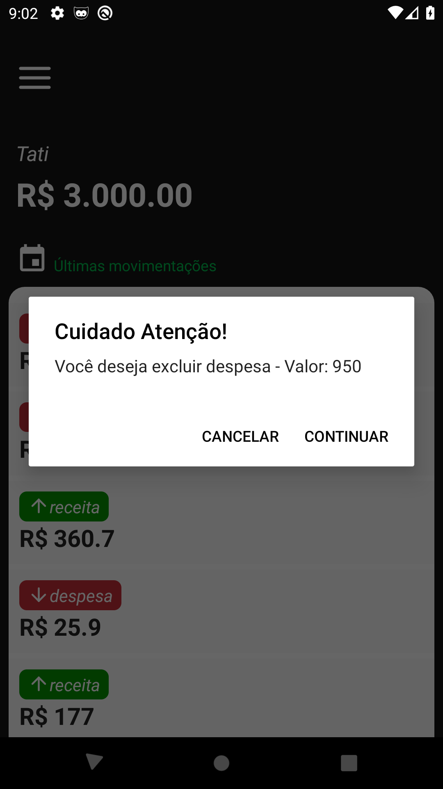
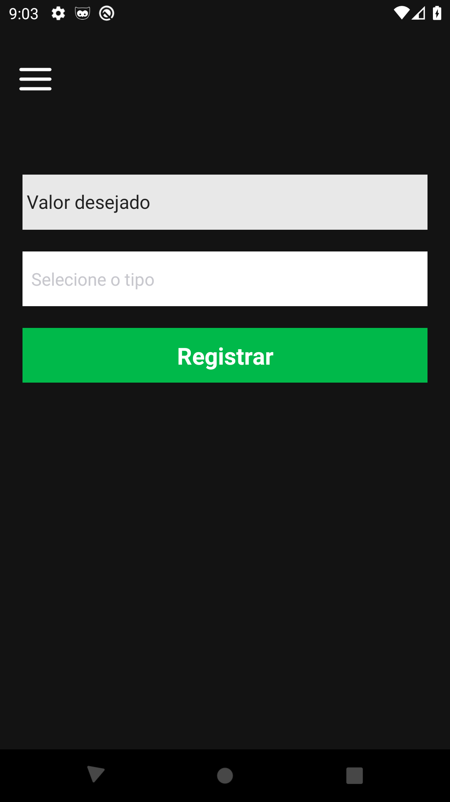

Projeto criado em React Native para controle financeiro, utilizando o conceito de Context Api.

### Bibliotecas utilizadas

• async-storage

• datetimepicker

• masked-view

• react-navigation

• date-fns

• firebase

• moment

• react-native-gesture-handler

• react-native-picker-select

• react-native-reanimated

• react-native-safe-area-context

• react-native-screens

• react-native-vector-icons

• styled-components

### Para testar

### mobile
react-native run-android

### screenshots

